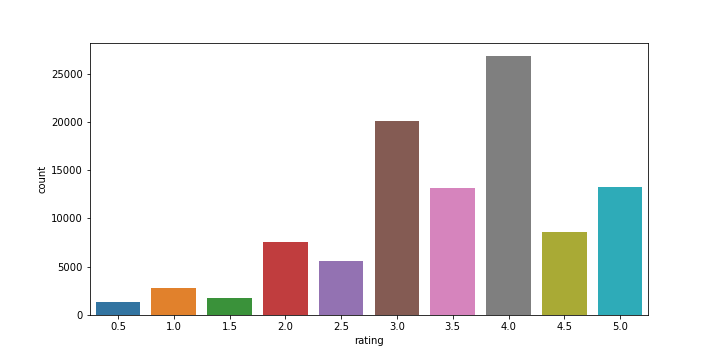

# Movie Recommendation System
* Created a model to predict the similar interest of movies based on the search preferences of the users while searching the movies of their interests.
* As a model I used KNN algorithm which is based on the nearest neighbors. The more the data are closer to the neighbors, the data belongs to the specific neighbors.
* Sparse matrix is used for the dataset which is an efficient way for categorizing the data.
* fuzzywuzzy package is used externally and installed from the anaconda prompt, which is used for measuring the similarity between two strings.

# Code and Resources Used
Python version : 3.8.3 Packages: pandas, numpy, matplotlib, seaborn, scikitlearn

# Problem Definition
The problem we are trying to solve is about estimating the similar interests of movies lists based on the users preferences search.
>Will our model predict the recommendation sysytem for movies?

# Tools
* Numpy - for numerical operations
* Pandas - for data analysis
* Matplotlib - for data visualization
* Seaborn - it is similar as matplotlib with some advanced features
* Sklearn(Scikit-Learn) - the machine learning framework for modelling the dataset

# EDA(Exploratory Data Analysis)

> Counting the ratings, that is to ensure what is the average highest rating in the scale of (0.0 to 5.0)

* ©️ Santosh Thapa 2020

